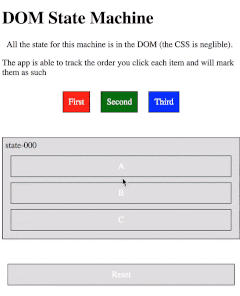

This blog post is based on a talk I wrote and gave at a few local meetups; [SydCSS](https://www.meetup.com/en-AU/SydCSS/events/254743276/), [SydJS](https://www.sydjs.com/meetups/community-sourced-scripting) and Atlassian's internal Front End Forum (FEF). It's a fun, lighthearted look at some hobby projects I did to see how crazy of an app I could create using nothing but HTML and CSS.

If you know any one hosting talks, I would absolutely love to give it again, so feel free to pass my details on!

### First: Links to related projects

- [CSS Binary Decoder](/projects/css-binary-decoder/)
- [CSS Tic Tac Toe](/projects/css-tic-tac-toe/)
- [CSS Rhythm Game](/projects/css-rhythm-game/)

### Second: The idea

So, this whole idea actually goes back to almost a year ago to the day that I'm writing this. It started with a small codepen testing how hard it would be to make a simple state machine using HTML and CSS. The first test was a small app that kept track of the order you clicked a set of buttons. You can see the original pen [here](https://codepen.io/hotmilo23/pen/mqeVpo).

<!-- To do: look into replacing with .mp4's -->
<!-- <video src="../images/dom-state-machine.mp4"></video>  140kb!!! -->

<div style="display: flex; justify-content: center;">



</div>

This turned out pretty successful. After a lot of fiddling with ways of representing state, I'd come up with a pretty cool pattern for representing state machines. I knew at this point it should be hypothetically possible to create Tic Tac Toe in HTML and CSS. The only question was whether this would require too many states to be useable...

I spiked this one night, showing it was possible to generate all the states (though, quite naively) and then... ... Never got around to actually finishing to project.

Cut to nearly a year later and I decide to give it another go, starting from scratch since the previous method of generating states wasn't going to be super useful for generating the required dom.

### The Results

The tests were even better than expected. After playing around with some optimizations to prevent us refinding already visited states and being smarter about how we looked up said states in memory, I was able to generate all 5000+ states in under a second.

I added in some winning/losing logic and I was done! A full working game in nothing but HTML and CSS! (you can see it in action [here](https://css-ttt.netlify.com/2.html)).

This was no where near the end of the rabbit hole though...

### The AI

A year earlier I had already considered what else would be possible using CSS state machines assuming the browser could handle them. I had already planned out how to write a "tic tac toe AI" should it be possible to have this much DOM in the browser.

The idea was pretty simple. If I could already represent all the states a 2 player game could end up in, I could skip every second step by having my script choose every second move based on a predetermined algorithm. The game of Tic Tac Toe is already very solved, it's quite trivial to write a bot that will always either win or draw, because any player playing perfectly can achieve that.

There are a ton of different ways I could have implemented the AI, but my goal was to make it as simple to follow as possible.

```js
function getComputerMove(state) {
  const { oppMoves, ourMoves } = extractPlayersMoves(state);
  const winner = getWinner(state);
  if (winner) return null;

  if (oppMoves.length === 1) return oppMoves[0] === 5 ? 9 : 5;
  if (oppMoves.length === 2) {
    if (oppMoves.includes(1) && oppMoves.includes(9)) return 2;
    if (oppMoves.includes(3) && oppMoves.includes(7)) return 2;
  }
  for (let set of WINNING_SETS) {
    const weStillNeed = set.filter(move => !ourMoves.includes(move));
    const oppHas = set.filter(move => oppMoves.includes(move));

    if (weStillNeed.length === 1 && oppHas.length === 0) {
      return weStillNeed[0];
    }
  }
  for (let set of WINNING_SETS) {
    const oppStillNeeds = set.filter(move => !oppMoves.includes(move));
    const weHave = set.filter(move => ourMoves.includes(move));

    if (oppStillNeeds.length === 1 && weHave.length === 0) {
      return oppStillNeeds[0];
    }
  }
  const emptySquares = [5, 1, 3, 7, 9, 2, 4, 6, 8].filter(
    sq => !state.includes(sq)
  );
  return emptySquares[0];
}
```
